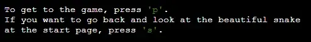

# Snake Game - Python Edition

## Introduction

The project is all about having fun and maybe increase your reflexes. It is a way of going back in time to when Nokia 3310 was the most hightec phone at the market. 

## Table of Contents

- [Snake Game - Python Edition](#snake-game---python-edition)
  - [Introduction](#introduction)
  - [Table of Contents](#table-of-contents)
  - [User Experience](#user-experience)
    - [User Stories](#user-stories)
      - [User Goals](#user-goals)
      - [Site Owner Goals](#site-owner-goals)
  - [Design](#design)
    - [Color Scheme](#color-scheme)
    - [Typography](#typography)
    - [Imagery](#imagery)
    - [Wireframes](#wireframes)
    - [Flowcharts](#flowcharts)
  - [Features](#features)
    - [Outside the terminal](#outside-the-terminal)
      - [Run program button](#run-program-button)
      - [Keyboard](#keyboard)
    - [Start page](#start-page)
      - [Start snake](#start-snake)
      - [Start menu](#start-menu)
    - [Rules page](#rules-page)
      - [Rules](#rules)
      - [Go back options](#go-back-options)
    - [Highscore page - top ten](#highscore-page---top-ten)
      - [Progress bar](#progress-bar)
      - [Highscore top ten](#highscore-top-ten)
    - [Get ready page](#get-ready-page)
      - [Enter name](#enter-name)
      - [Are you ready?](#are-you-ready)
    - [Game page](#game-page)
      - [Game area](#game-area)
      - [Live score](#live-score)
    - [Highscore page - top five](#highscore-page---top-five)
      - [Progress bar](#progress-bar-1)
      - [Highscore top five](#highscore-top-five)
      - [Play again?](#play-again)
    - [Goodbye page](#goodbye-page)
  - [Features to be Added](#features-to-be-added)
  - [Testing](#testing)
    - [Validation of Code](#validation-of-code)
    - [Lighthouse](#lighthouse)
    - [Wave Webaim](#wave-webaim)
    - [Contrast Grid](#contrast-grid)
    - [Manual Testing](#manual-testing)
  - [Technologies Used](#technologies-used)
  - [Deployment](#deployment)
  - [Credits](#credits)
  - [Acknowledgements](#acknowledgements)

## User Experience

### User Stories

#### User Goals

The goal is to make the user have a good time. Maybe experience a flashback or two back until when your biggest entertainment was to play Snake at a Nokia 3310. The goal is also to get the user to challenge itself to beat its score.

#### Site Owner Goals

THe site owners goal is to provide an easy and fun place in the high technology enviroment with anvanced graphic we live in. 

## Design

### Color Scheme

The white background makes the black terminal pop out. The high contrast it's providing makes it easier to see and play the game without getting distracted.

The color at the snake is chosen to be eye-catching and pop out from the text. The colors in the button are chosen to be more neutral than the snake, since you need to look at the bottom when you are playing the game. They are green to bond to the green snake.

### Typography

The font in the terminal is not changed, to give the true retro feeling. The font in the buttom is chosen to make it easy to read.

### Imagery

The keyboard is chosen to be neutral but at the same enhance the retro feeling for the user. The retro feeling is even more enhanced thanks to it being and old Atari keyboard.

### Wireframes

The wireframe of the start page.

The wireframe of the game area.

### Flowcharts

The flowchart of the logic of the Snake game.

## Features

### Outside the terminal

#### Run program button

The Run program button allows the user to restart the game whenever they want to.

#### Keyboard

The keyboard provides a retro feeling and are consistent during the entire game. 

### Start page

The first page which gives the user a welcome.

#### Start snake

The snake at the start page is supposed to welcome the user and present which game the user are welcome to play.

#### Start menu

The start menu gives the user opportunity to select what they want to do. They get to choose from start the game, read the rules or see the highscore.

### Rules page

#### Rules

The rules explain to the user how they are supposed to play the game.

#### Go back options

The user gets the option to navigate back to the start page or to start the game. This choice prevents a need to restart the game to be able to play the game.

### Highscore page - top ten

#### Progress bar

The progress bar let the user know that something is happening and the highscore is calculating.

#### Highscore top ten

Top ten highscore is presented to motivate the user to play and beat the highscore. They may find their friend (or enemy) on the list, to know which score they have to beat!

#### Go back options

The user gets the option to navigate back to the start page or to start the game. This choice prevents a need to restart the game to be able to play the game.

### Get ready page

#### Enter name

The user have to enter their name to be ready for entering the highscore list.

#### Are you ready?

This text allows the user to prepare themself and start the game when they are ready.

### Game page

#### Game area

The game area is where the magic happens. The snake moves around to collect the apples. The snake are made out of blocks and the apples are dots. They are different shapes to help the user to easier see the difference between the snake and the apple.

#### Live score

The score is located at the top of the game area and is updating every time the snake eats an apple. This helps the user to keep track of their current score during the game.

### Highscore page - top five

#### Progress bar

The progress bar let the user know that something is happening and the highscore is calculating.

#### Highscore top five

Top five highscore is presented to see if the player could beat the highscore. They may find their friend (or enemy) on the list, to know which score they have to beat next time they play!

#### Play again?

The user gets a question if they want to play again or if they want to quit. This allows the user to play again to beat their score.

### Goodbye page

The user gets a thank you for playing and a reminder that they are always welcome back.

## Features to be Added

One feature to be added is to select which color you want the snake to have. Someone may play better with a pink snake, who knows? Some other features that could be added is that the game area will be smaller after x number of points and make it smaller and smaller until it is impossible to navigate the snake.

## Testing

### Validation of Code

The validation of the HTML code at [W3C Markup Validation Service](https://validator.w3.org/) resulted without errors.

The validation of the Python code at [CI Python Linter](https://pep8ci.herokuapp.com/) resulted without errors.

### Lighthouse
You can perform a test of your website for performance, accessibility, best practices and SEO through the google chrome lighthouse test - it is in your Dev tools. Bear in mind that your internet connection speed plays a part in the performance figures obtained. Where it scores low, it will give you suggestions on how to improve the site - read the suggestions and think about how to implement them - it could be a good idea.
Do this for both Desktop and Mobile.

### Wave Webaim

The validation of the accessibility at [Wave Webaim](https://wave.webaim.org/) resulted without errors.

### Contrast Grid

The contrast test at [Contrast Grid](https://contrast-grid.eightshapes.com/?version=1.1.0&background-colors=&foreground-colors=%23FFFFFF%2C%20%20Text%0D%0A%23013220%2C%20Button%0D%0A%23000000%2C%20Terminal%0D%0A%23008000%2C%20Snake&es-color-form__tile-size=compact&es-color-form__show-contrast=aaa&es-color-form__show-contrast=aa&es-color-form__show-contrast=aa18&es-color-form__show-contrast=dnp) resulted in AAA values for all combination used in the game except for one. The combination of the black terminal background and the green ascii-snake resulted in only a AA18 value (4). Even though the bad contrast result, the combination is kept since the combination is never used to present any text.

### Manual Testing

Every page at the website has been manually tested. It is done in Google Chrome DevTools and on different devices. The devices used were one mobile phone, one laptop and one external screen:

- Samsung Galaxy A52s (1080 x 2400)
- HP 250 G4 Notebook PC (1366 x 768)
- HP 2309v LCD Screen (1920 x 1080)

You need to perform, and document everything you did to manually test your site.
At a minimum - you need to check every link on every page works as intended.
So that is check every link in the nav bar (do this on every single page because its a link in a different file) and any other links that appear on your site.
Test the responsiveness of the site - you can do this in the dev tools in responsive mode.
You should also load the site once deployed on as many devices you have access to. What is different from one device to the next? why is it different?

Test the user stories that you created earlier in the readme - did you satisfy the goal, how?

To write up the tests you can use a table,
| Feature being tested | Expected Outcome | Testing Performed | Actual Outcome | Result (Pass or fail) |
| -------------------- | ---------------- | ----------------- | -------------- | --------------------- |
| enter details here | enter details here | enter details here | enter details here | enter details here |

You should have tests for every section of every page.. individually.

## Technologies Used

The code language used were Python, CSS, and HTML. The main code is written in Python. The repository is created at [GitHub](https://github.com/), the code is written in VS Code and it is deployed at [Heroku](https://dashboard.heroku.com/apps).

The flowchart is made at [Lucid](https://lucid.app/). The wireframes are made at [Figma](https://www.figma.com/).

## Deployment

The site was deployed at Heroku by doing the following steps.

- Open Heroku and log in
- Click on "New" and choose the option "Create new app"
- Choose an appname and which region (Europe or United States) you are located in
- Press "Create app"
- When the app is created, choose the Settings tab
- Under "Config Vars", press "Reveal Config Vars"
- In keys, write CREDS
- In value, insert the code from the creds.json file
- Press "Add"
- In keys, write PORT
- In value, write 8000
- Press "Add"
- Under "Buildpacks", press "Add buildpack"
- Choose "Python, press "Add buildpack"
- Choose "Nodejs", press "Add buildpack"
- Change tab to the Deploy tab
- Choose deploy method - GitHub
- Search for the correct repository name at your connected GitHub account
- Press "Connect"
- Under "Manual deploy", choose which branch to deploy and press "Deploy Branch"

Link to the website <https://python-snake-57da97dc4eec.herokuapp.com/>

## Credits

The snake favicon is from [Favicon](https://favicon.io/emoji-favicons/snake). The keyboard image is a free image from [Pixabay](https://pixabay.com/). It is resized at [ResizePixel](https://www.resizepixel.com/). The favicon, the image at the site and the images in the README are converted to webp at [Convertio](https://convertio.co/) and [Pixelied](https://pixelied.com/) and compressed at [Tinify](https://tinypng.com/). The Ascii snake is based at the snake from [Asciiart](https://asciiart.cc/view/11831). The ascii text is generated at [ascii-generator](https://ascii-generator.site/t/) with the font "amc3line". The Unicode characters for the [apple](https://www.compart.com/en/unicode/U+25CF) and [snake body](https://www.compart.com/en/unicode/U+25A0) are from [Compart](https://www.compart.com/en/unicode).

Knowledge about parts of the code were gathered from different sources.

| Knowledge about | Source |
| -------------------------- | --------------- |
| Clear screen | [Tutorialspoint](https://www.tutorialspoint.com/how-to-clear-python-shell) |
| Randint (in Random Module) | [Prepbytes](https://www.prepbytes.com/blog/python/python-random-module/) |
| Curses module | [Python](https://docs.python.org/3/howto/curses.html) |
| Using .format() | [Pyformat](https://pyformat.info/#string_pad_align) |
| Cursor package | [PyPi](https://pypi.org/project/cursor/) |
| RegEx Module | [W3Schools](https://www.w3schools.com/python/python_regex.asp) |
| Rich Package | [Real Python](https://realpython.com/python-rich-package/)   [Read the docs](https://rich.readthedocs.io/en/stable/index.html) |

## Acknowledgements

Big thanks to Matt Bodden for great coding support! Also a big thanks to Linus Wikell for testing the game during the development and thanks for the proofreading! 

[Back to top](#snake-game---python-edition)